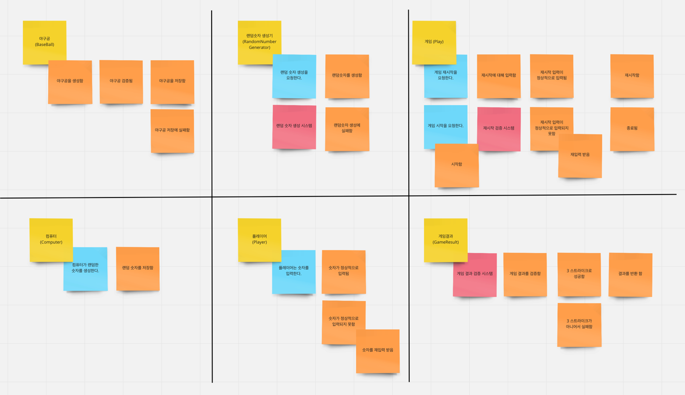
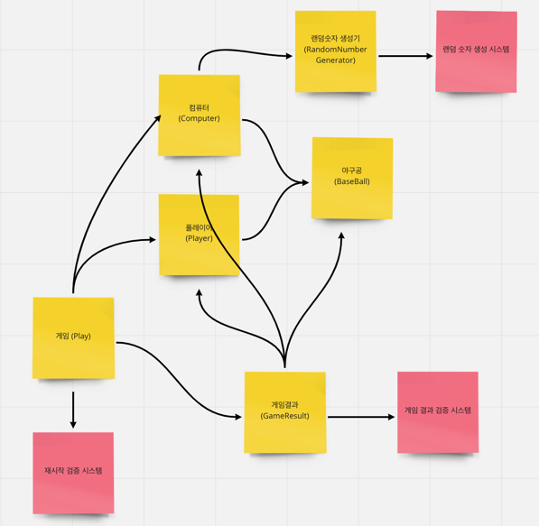

# 숫자 야구 게임
## 1. Event Storming 을 통한 기능 목록 작성
```
파란색 : command or action
주황색 : event
노란색 : domain
빨간색 : external system
```
### Event Storming

### Diagram


## 2. 기능 구현 목록
### 2.1. 도메인 구현
- [x] 야구공 도메인 구현
- [x] 숫자 생성기 도메인 구현
- [x] 컴퓨터 도메인 구현
- [x] 플레이어 도메인 구현 
- [x] 게임결과 도메인 구현
- [x] 스트라이크, 볼을 판단하는 로직 구현
### 2.2. 서비스 구현
- [x] 컴퓨터와 플레이어가 게임한 뒤, 스트라이크/볼을 판단하는 로직 구현
- [x] 컴퓨터가 랜덤한 숫자를 요청하는 로직 구현
- [ ] 재시도 처리
- [ ] input, output validation
